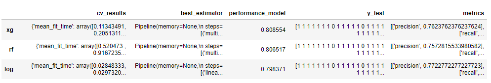

# Automatic Machine Learning solver
> A maching learning problem solver for typical kaggle datasets. (ie. with a trainset and a testset)

## Table of contents
* [General info](#general-info)
* [Technologies](#technologies)
* [Features](#features)
* [Run](#run)
* [Status](#status)
* [Inspiration](#inspiration)
* [Contact](#contact)

## General info
The Automatic Machine Learning solver has the goal to give you quick insight about your Machine Learning problem.
It's give you 3 "clean" quick and dirty models, and them benchmarks scores. With that insights, you can have a best estimation of the performance you can achieve, and what kind of models work better. (Linear, boosting, or bagging) 
## Screenshots

## Technologies
> * python - Version 3.7
> * pandas - Version 0.25
> * scikit-learn - Version 0.21

The code was tested and adapted for these dependencies.

## Features
List of features ready
* Missing Values handling
* Categorial features handling for each kind of model
* Optimization of each model by GridSearch
* Model evaluation (train and valid set)

To-do list:
* GridSearch CV is optimized by the default scorer of the estimator (which can be non adapted for example in case of a classification problem with imbalanced class, the default scorer is the accuracy which should not be used)
* The solver is still very generic

## Run

Go to the [main.py](https://github.com/bernadinel/Ml_Problem/blob/master/main.py) script and precise every argument of the main function:
+ output_dir: Where the result should be stored
+ name: The name of the problem to solve
+ type_ml: The type of Machine Learning problem: Classification 'clf' or Regression 'r'
+ path_train: The path to the csv trainfile
+ path_test: The path to the csv testfile
+ id_col: The column of the id
+ cible_col: The column of the target

## Status
Project is: _in progress_

## Contact
Created by [@bernadinel](https://www.linkedin.com/in/levi-bernadine-b774b0a7/) - feel free to contact me!